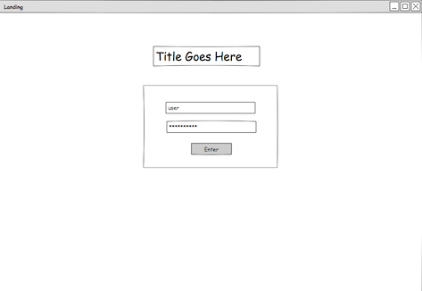
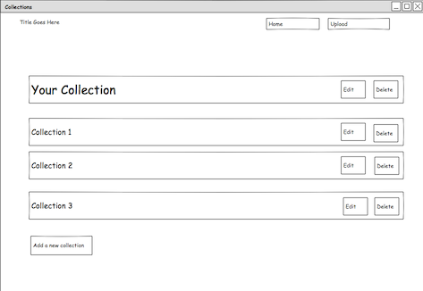
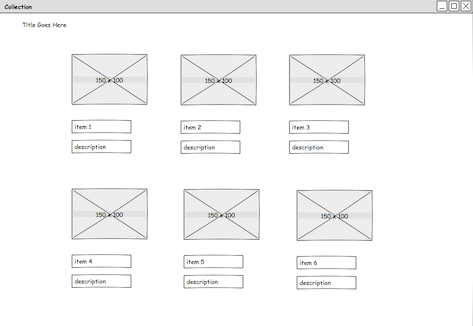
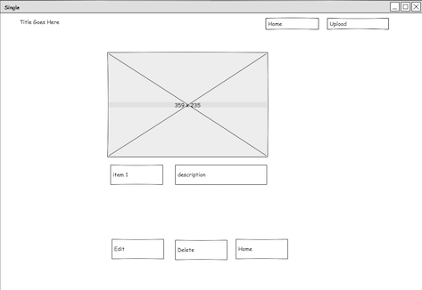

# Project4_CollectionsApp

###Concept

- A site for people who collects things. 
- Database will have users, lists, items, categories table.
- User will be able to upload and keep track of all their collections.

## Wireframes ###

#### Landing Page ###

#### Home Page ###

#### Collection ###

#### List Page ###

##Website Navigation

-Welcome page
-Log in
-List page(list all the collection)
 will be able to add, edit and delete collection
-Item page(list all the items in a collection)
 will be able to show, add, edit and delete the single collection

###Project will have two crud functioanlites.

- Phase 1 CRUD APPLICAION with create, edit, and delete functionality.
- Implement filestack image API

###Technologies Used

- Ruby on Rails
- Bootstrap
- HTML & CSS

###Unsolved problems

- Not all funtionalities are working
- API (post-MVP): Didn't get to implement filestack api

