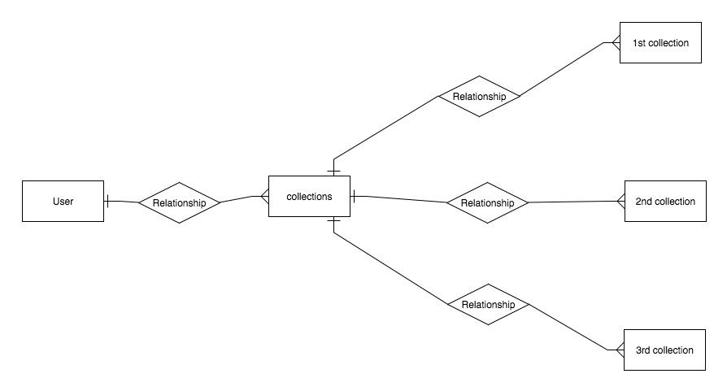

*** Project 4 Proposal 10/6/17 ***

#Mission Statement#

# My version of Pinterest #

A CRUD App will allow users to store their items of interst. 
It could be a collection of idea, inspiration/reference items or simply a collection of baseball cards.

## Priority Matrix ###

## Wireframes ###

#### Landing Page ###

#### Home Page ###

#### Collection ###

#### List Page ###

### Initial Thoughts on Structure ###
The app will utiliz Filestack Api that will allow users to upload images, videos and audios 

### Database ###

### Technologies  ###

### Potential API ###
Filestack Api

### Potential API ###
